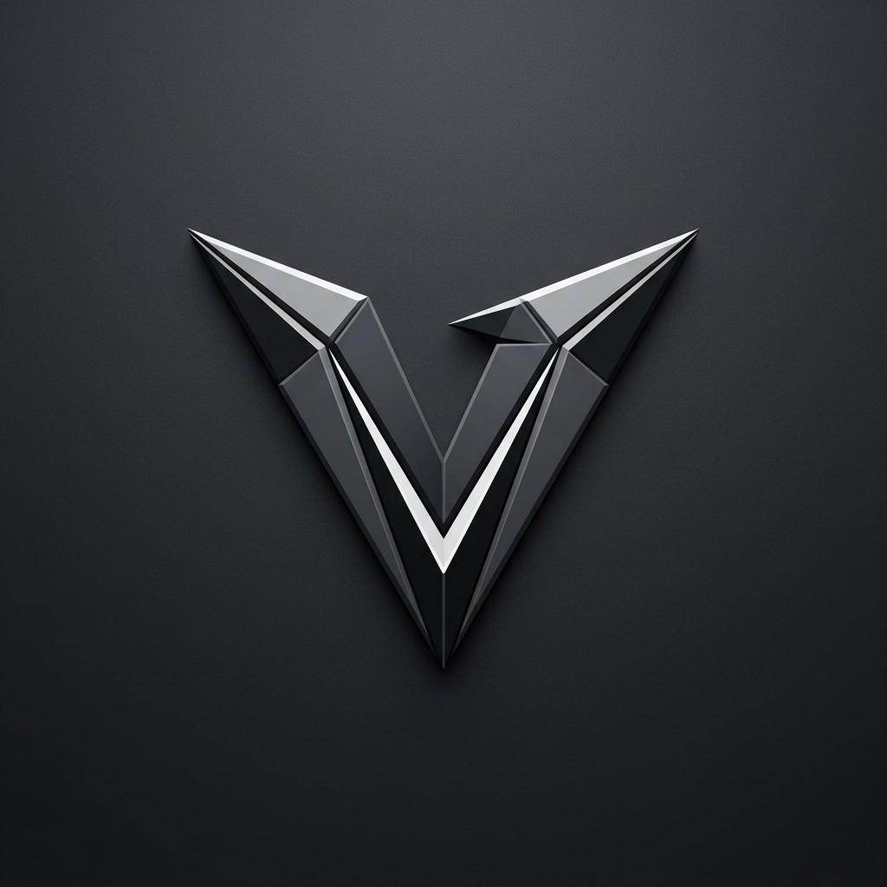

<div align="center">
  
  <h1>Vector AI Command Center</h1>
  <p>Your Autonomous Digital C-Suite.</p>
  <p>
    <a href="https://vector-ai.vercel.app"></a>
    
    <a href="https://insforge.dev"></a>
    
  </p>
</div>

---

**Vector** is a multi-agent SaaS platform designed to act as your enterprise AI executive council. Whether you need startup ideation, zero-trust cloud architecture, fintech modeling, or viral go-to-market strategies, Vector puts a full AI C-suite at your fingertips, allowing you to build entire startups in seconds.

Built with a lightning-fast **Next.js 16** frontend, powered by **Google Gemini 2.5 Flash**, and natively integrated with **InsForge PostgreSQL** for persistent memory.

## ✨ The Executive Council

- 🧠 **Prism (Lead Architect)**: The master orchestrator. Prism analyzes your requests, delegates tasks, and synthesizes the outputs of the council.
- 💼 **Atlas (CEO)**: Focuses on business strategy, seed-round pitch decks, startup valuation, and enterprise sales motions.
- 💻 **Nexus (CTO)**: Architects zero-trust cloud infrastructure, telemetry pipelines, and scalable database schemas.
- 📢 **Vanguard (Marketing)**: Designs cinematic brand positioning, influencer outreach, and viral gamified engagement loops.
- 📈 **Ledger (Finance)**: Builds fintech monetization models, Stripe subscription architectures, and cloud cost optimization plans.

## 🚀 Key Features

- **Instantaneous Cinematic UI**: A premium, glassmorphism dashboard featuring highly reactive agent status cards, buttery-smooth Framer Motion staggered animations, and zero-latency document rendering.
- **Autonomous Project Architecting**: The AI automatically generates crisp, contextual titles (e.g., "Retro TV SaaS") and builds massive, production-ready markdown documents (Executive Summaries, Architecture Specs, GTM Plans) seamlessly stored in the database.
- **Agent-Native Memory (InsForge)**: Natively integrated with **InsForge PostgreSQL** utilizing `pgvector`. Chat histories, massive project hierarchies, and contextual embeddings are permanently saved across sessions.
- **Zero-Trust Data Scrubbing**: Built for enterprise. Strict context routing ensures that the Finance agent doesn't overwrite the CTO's architecture notes.

## 🛠 Tech Stack

**Frontend & Orchestration Engine**
- **Framework**: Next.js 16 (App Router, Turbopack)
- **Styling**: Tailwind CSS, Framer Motion, Cinematic UI Tokens
- **AI Engine**: Google Gemini 2.5 Flash (`@google/generative-ai`)
- **Database & Memory**: **InsForge PostgreSQL** (pgvector for RAG)
- **Deployment**: Vercel

---

## 💻 Local Setup

Built to be completely serverless.

### Prerequisites
- Node.js 18+
- PostgreSQL Database (via InsForge or Supabase)
- Google Gemini API Key

### 1. Installation
Clone the repository and install the Next.js dependencies:
```bash
git clone https://github.com/a-sweet-debug/the-vector.git
cd the-vector
npm install
```

### 2. Environment Configuration
Create a `.env.local` file in the root directory. **Never commit this file to version control:**
```env
# Database connection for Project & Chat Memory
POSTGRES_URL="postgresql://<user>:<password>@<host>:<port>/<db>?sslmode=require"

# Gemini AI Integration
GEMINI_API_KEY="<YOUR_GEMINI_API_KEY>"
```

### 3. Run the Application
Start the Next.js development server:
```bash
npm run dev
```
Visit `http://localhost:3000` and enter the Board Room to initialize your first project!

---

## ☁️ Deploying to Vercel

The platform is completely serverless and fully optimized for zero-configuration Vercel deployment.

1. Push your code to a GitHub repository (ensure `.env.local` is listed in your `.gitignore`).
2. Go to your Vercel Dashboard and click **Add New... > Project**.
3. Import your GitHub repository.
4. **Leave the Root Directory completely blank** (`./`). Vercel will automatically detect the Next.js application at the root.
5. Add your Environment Variables (`POSTGRES_URL` and `GEMINI_API_KEY`).
6. Click **Deploy**!

## 📄 License

This project is licensed under the MIT License - see the LICENSE file for details.
